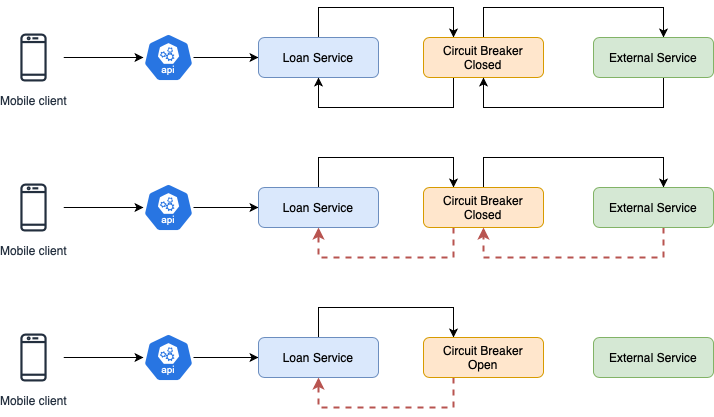

# PantorePay

Este projeto tem como proposito propor a Arquietura de Solucao para o Sistema de Emprestimos Pantore

## Escopo
A Pantore Pay é uma empresa de serviços financeiros dedicada a ser uma parceira de crescimento para restaurantes, fornecendo capital giro e crédito financeiro para seu negócio decolar.
## Arquitetura de Solucao
Este documento tem como objetivo apresentar uma visão geral abrangente da arquitetura de software do sistema Pantore e especificar decisões arquiteturais pertinentes.
## Visa Geral

Este documento contém os detalhes sobre as características arquiteturais escolhidas pela equipe de desenvolvimento para a solução em software do projeto Pantore Pay. Nele estão contidos os seguintes pontos, respectivamente: Representação da Arquitetura, Metas e restrições de Arquitetura, Visão lógica e Visão de implementação.
## Representação da Arquitetura
A arquitetura utilizada no projeto será baseada em microsserviços. Microsserviço é uma abordagem para desenvolver uma única aplicação como um conjunto de serviços, cada um rodando em seu próprio processo e se comunicando através de mecanismos leves, geralmente através de uma API HTTP. Estes serviços são publicados em produção de maneira independente através de processos de deploys automatizados.
## Metas e Restrições de Arquitetura
- Linguagem:	Java e JavaScript
- Framework:	Springboot
- Plataforma: Amazon Web Services	
- Observabilidade:	O sistema tera a Observabilidade atraves do Grafana gerenciado pela AWS integrado com o Amazon Cloudwatch.
- Segurança:	O sistema garantira a seguranca das informacoes utilizando Autenticacao via Cognito e Validacao de Tokens de Seguranca via AWS Lambda
## Visao Logica

- A aplicação Pantore Pay é construída sobre a biblioteca ReactNative no Mobile e sobre o Springboot Framework no back-end. 
- O ReactNative é uma biblioteca responsável apenas pela parte da "view". 
- O framework Springboot utiliza uma abordagem baseada em Arquitetura de Microservicos. 
- O desenvolvimento em Microservicos é benéfico pois tem custos reduzidos de desenvolvimento e manutenção e também é de fácil reutilização em outros projetos.
- A aplicacao usara o Player Amazon Web Services para .

## Tolerancia a Falhas

- Circuit Breaker

- Recuperação mais rápida: O Circuit Breaker permite que o serviço com problema se recupere, o que pode levar a uma recuperação mais rápida. 

- Melhor experiência do usuário: O Circuit Breaker evita que o aplicativo trave, permitindo que os usuários recebam uma resposta rápida ou uma mensagem alternativa. 

- Gestão de recursos: O Circuit Breaker evita que o sistema continue tentando alcançar um serviço indisponível, economizando recursos. 

- Evita falhas em cascata: O Circuit Breaker evi ta que uma falha em um serviço se propague para outros serviços, evitando um efeito dominó. 
- Aumenta a resiliência: O Circuit Breaker aumenta a resiliência do sistema, permitindo que ele continue disponível mesmo que algum serviço pare de responder. 
-  O Circuit Breaker funciona como um disjuntor, monitorando a comunicação entre os serviços e interrompendo temporariamente a comunicação com os serviços que estão com problemas.

