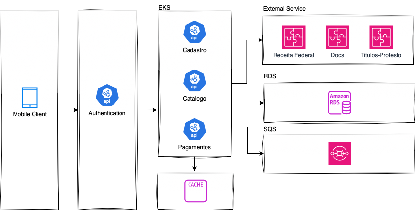

# PantorePay

Este projeto tem como proposito propor a Arquietura de Solucao para o Sistema de Emprestimos Pantore

## Escopo
A Pantore Pay é uma empresa de serviços financeiros dedicada a ser uma parceira de crescimento para restaurantes, fornecendo capital giro e crédito financeiro para seu negócio decolar.
## Arquitetura de Solucao
Este documento tem como objetivo apresentar uma visão geral abrangente da arquitetura de software do sistema Pantore e especificar decisões arquiteturais pertinentes.
## Visa Geral

Este documento contém os detalhes sobre as características arquiteturais escolhidas pela equipe de desenvolvimento para a solução em software do projeto Pantore Pay. Nele estão contidos os seguintes pontos, respectivamente: Representação da Arquitetura, Metas e restrições de Arquitetura, Visão lógica e Visão de implementação.
## Representação da Arquitetura
A arquitetura utilizada no projeto será baseada em microsserviços. Microsserviço é uma abordagem para desenvolver uma única aplicação como um conjunto de serviços, cada um rodando em seu próprio processo e se comunicando através de mecanismos leves, geralmente através de uma API HTTP. Estes serviços são publicados em produção de maneira independente através de processos de deploys automatizados.
## Metas e Restrições de Arquitetura
- Linguagem:	Java e JavaScript
- Framework:	Springboot
- Plataforma: Amazon Web Services	
- Observabilidade:	O sistema tera a Observabilidade atraves do Grafana gerenciado pela AWS integrado com o Amazon Cloudwatch.
- Segurança:	O sistema garantira a seguranca das informacoes utilizando Autenticacao via Cognito e Validacao de Tokens de Seguranca via AWS Lambda
## Visao Logica

- A aplicação Pantore Pay é construída sobre a biblioteca ReactNative no Mobile e sobre o Springboot Framework no back-end. 
- O ReactNative é uma biblioteca responsável apenas pela parte da "view". 
- O framework Springboot utiliza uma abordagem baseada em Arquitetura de Microservicos. 
- O desenvolvimento em Microservicos é benéfico pois tem custos reduzidos de desenvolvimento e manutenção e também é de fácil reutilização em outros projetos.
- A aplicacao usara o Player Amazon Web Services para .

## Tolerancia a Falhas

- Circuit Breaker

- Recuperação mais rápida: O Circuit Breaker permite que o serviço com problema se recupere, o que pode levar a uma recuperação mais rápida. 

- Melhor experiência do usuário: O Circuit Breaker evita que o aplicativo trave, permitindo que os usuários recebam uma resposta rápida ou uma mensagem alternativa. 

- Gestão de recursos: O Circuit Breaker evita que o sistema continue tentando alcançar um serviço indisponível, economizando recursos. 

- Evita falhas em cascata: O Circuit Breaker evi ta que uma falha em um serviço se propague para outros serviços, evitando um efeito dominó. 
- Aumenta a resiliência: O Circuit Breaker aumenta a resiliência do sistema, permitindo que ele continue disponível mesmo que algum serviço pare de responder. 
-  O Circuit Breaker funciona como um disjuntor, monitorando a comunicação entre os serviços e interrompendo temporariamente a comunicação com os serviços que estão com problemas.

## Escalabilidade

-  Apos as metricas coletadas a partir dos paineis AWS e Grafana a estrategia de configuracao do Auto Scaling sera de forma horizontal para garantir a alta disponibilidade de acordo com o Pico de uso do Sistema identificado pelos testes de estresse. Dessa forma a alta disponibilidade estara garantida.

## Cache

- Sera utilizado o AWS ElasticCache para reduzir custos de banco de dados.  Dessa forma garantimos a melhora do desempenho da aplicacao, aumento o rendimento e diminuicao da latência, e melhorar a performance do banco de dados e das aplicações.

## Failover e Backup

- Monitorar continuamente os componentes do sistema
- Definir os cenários de carga que serão simulados
- Criar perfis de tráfego baseados em dados históricos
- Executar testes de stress e carga
- Identificar gargalos na infraestrutura

Com as informacoes em maos apos a aplicacao das diretivas acima, sera utilizada a seguinte abordagem:

Failover ativo-passivo: O sistema de backup permanece inativo até que o sistema principal falhe 

Caso o sistema principal falhe, as requisicoes sao direcionadas para o sistema de backup.

Tao logo o sistema principal esteja novamente funcional, sera executado o failback

## Versionamento

- A aplicaccao sera versionada em um repositorio Git e seguindo as praticas de Gitflow.
- Brancches bem definidas para cada etapa do desenvolvimento, por exemplo:
  - Brach Main: Branch imutavel por commit. Esta branch somente e alimentada por merges realizados de Dev.
  - Branch Dev: Branch onde sao desenvolvidas as novas funcionalidades do sistemas
  - Branch Test: Branch especifica para realizacao dos testes automatizado
  - Featue Branch: Uma nova branch e criada a partir da branch dev para o desenvolvimento de uma funcionalidade
  - BugFix Branch: Branch criada a partir de uma Feature Branch dev para que o Bug seja corrigido
  - Hotfix: Branch exclusiva para solucionar problemas em producao.

## CI/CD

Sera utilizado o GitLab CI para garantir uma esteira de entrega automattizada da aplicacao. Dessa forma teremos os seguites ganhos:

- Aumento da qualidade e confiabilidade dos lançamentos de software
- Redução de erros humanos
- Melhoria da colaboração entre equipes
- Aceleração do ciclo de desenvolvimento
- Melhoramento da produtividade
- Redução de riscos
- Entrega mais rápida de novos recursos e atualizações
- Facilidade de reversão de alterações de código
- Visualização do status de cada ambiente e implantação
- Testes de desempenho e gerenciamento de incidentes
- Rastreio da velocidade de entrega da organização
- Revisões de código mais rápidas

## Code Review

- Cada membro da equipe de desenvolvimento esta apto a realizar o code review
- Caso alguma inconformidade com as melhores praticas de desenvolvimento seja identificada, sera discutida e solicitada a mudanca de abordagem da implementacao ou correcao da mesma

## Testes Automatizados
- Garanttir que sejam realizados testes automatizados para avaliar o comportamento da aplicacao nos cacsos testados, assim garantindo que o comportamento da aplicacao esteja como o esperado.
- Criar os casos de testes para que os mesmos sejam implementados em ferramentas, como o Selenium, e executados. Dessa formas teremos o report de execucao e comportamento da aplicacao.
## Multi A-Z
- De acordo com o crescimento de usuarios em diversos paises, a aplicacao ira neccessitar estar disponivel em outras zonas para manter a performance desejada para os usuarios. Com esta premissa, sera necessario distribuir a aplicacao em diferentes zonas e com o CloudFront redirecionando para a Zona mais proxima de acordo com a origem da requisicao.

